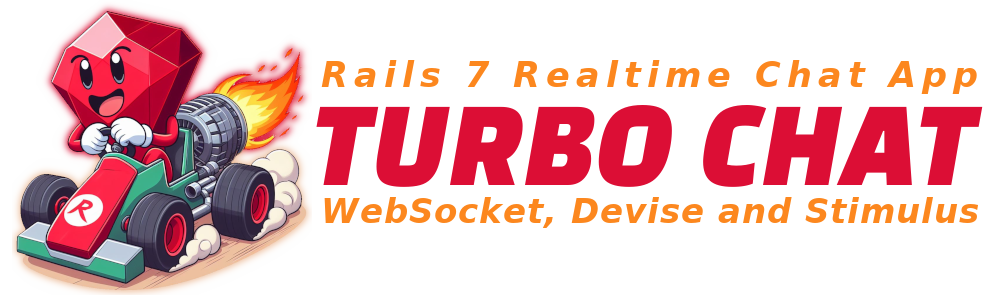

<a id="turbochat"></a>
# [ ](#turbochat) Ruby TurboChat Study

<!-- 
    Logo image generated by Bing IA: https://www.bing.com/images/create/
    Prompt: A giant anthropomorphic red ruby symbolizing the Ruby programming language feeling G-force, inside a kart with a fire-spitting turbine behind him, moving at a good speed. Flat colors, white background, cartoon comic book style. Keep the kart and the ruby within the frame of the image, without any cuts.
-->
[](#turbochat)

<!-- 
    icons by:
    https://devicon.dev/
    https://simpleicons.org/
-->
[](https://www.ruby-lang.org/en/) [](https://rubygems.org/) [](https://rubyonrails.org/) [](https://stimulus.hotwired.dev/) [](https://turbo.hotwired.dev/) [](https://dev.w3.org/html5/spec-LC/) [](https://www.w3.org/Style/CSS/Overview.en.html) [](https://developer.mozilla.org/en-US/docs/Web/JavaScript) [](https://ubuntu.com/) [](https://code.visualstudio.com/) 

<!--

[](https://www.sqlite.org/index.html) 

[](https://nodejs.org/en) [](https://webpack.js.org/)

[](https://cucumber.io/)

[](https://getbootstrap.com/)

[](https://www.jetbrains.com/ruby/download/#section=linux) [](https://www.docker.com/) [](https://docs.github.com/pt/actions)
-->

 <!---->


[](https://github.com/Deanout/turbo_chatroom) [](https://www.youtube.com/playlist?list=PL3mtAHT_eRex1sJI2uoTBgFT3qAXFbEcy)

_*This is an initial readme, here you can find the project's goals, and some features are not yet fully available._

---

## 🕸️ Found me in Web:

[](https://www.linkedin.com/in/jos%C3%A9-r-99896a39/) [](https://dev.to/learningenuity) [](mailto:learningenuity@gmail.com) [](https://twitter.com/aromademirtilo) [](https://www.instagram.com/learningenuity) 

---

## 📁 The Project:

<a id="index"></a>
### ⤴️ index:

__[Ruby TurboChat](#turbochat)__:<br/>
  1. ⤴️ [Index](#index)
  2. 📗 [About](#about)
  3. 💻 [Run the Project](#run)
  4. 🤖 [Use of AI](#ia)

<!--
  4. ✅ [Tests](#tests)
  5. 🪲 [Debug](#debug)
  6. 📊 [Diagrams](#diagrams)
  7. 🕵️ [Observability](#observability) 
-->
 
<br/>

[⤴️ Back to Index](#index)

---

<a id="about"></a>
### 📗 About:

#### 📋 Ruby On Rails Chat

This project aims to follow the recommended [Realtime Chat App With Ruby On Rails 7 List.](https://www.youtube.com/playlist?list=PL3mtAHT_eRex1sJI2uoTBgFT3qAXFbEcy) This repository is purely didactic and focused on deepening knowledge in the language and framework for utilizing websockets in a more comprehensive manner in future projects.

#### 📚 Another References

I also used the following videos in PT-BR as a source:
- [Turbo Frames and Turbo Stream templates](https://www.hotrails.dev/turbo-rails/turbo-frames-and-turbo-streams)

<br/>

[⤴️ Back to Index](#index)

---

<a id="run"></a>
### 💻 Run the Project:

We are currently running the application locally without containerization, but infra dependencies are dockerized

* Ruby Version:
    *  3.2.2 [Install Ruby Instructions](https://www.ruby-lang.org/en/documentation/installation/#apt)
<br/>

* Ruby on Rails Version:
    *  7.1.3
<br/>

 <!-- *  [Install NodeJs Instructions](https://nodejs.org/en)
  *  [Install Docker Instructions](https://docs.docker.com/engine/install/)

<br/>


 Run `docker compose` comands to create `up & running` infra dependencies:

```
$ docker compose build
$ docker compose up
```
-->
<br/>

[⤴️ Back to Index](#index)

---

<a id="ia"></a>
### 🤖 Use of AI:

The header figures on this page were created with the help of artificial intelligence and a minimum of retouching and construction in Gimp [](https://www.gimp.org/)

__The following prompts were used for creation in [Bing IA:](https://www.bing.com/images/create/)__


<details>
  <summary><b>Ruby Cartoon</b></summary>
"A giant anthropomorphic red ruby symbolizing the Ruby programming language feeling G-force, inside a kart with a fire-spitting turbine behind him, moving at a good speed. Flat colors, white background, cartoon comic book style. Keep the kart and the ruby within the frame of the image, without any cuts."<b>(sic)</b>
</details>


<br/>

AI also helped in some research in this study by being used as a support tool; however, __arts and development are, above all, human creative activities. Value people!__

Hire artists for commercial or more elaborate projects and Learn Ingenuity!

<br/>

[⤴️ Back to Index](#index)

<!--

<a id="tests"></a>
### ✅ Tests:

TODO: How to `Run the Test Suite`

<br/>

[⤴️ Back to Index](#index)

---

<a id="debug"></a>
### 🪲 Debug:

TODO: How to `Debug Application`

<br/>

[⤴️ Back to Index](#index)

---

<a id="diagrams"></a>
## 📊 System Diagrams:

<br/>

__[Entity Relationship Diagram PDF Link](./erd.pdf)__


[⤴️ Back to Index](#index)

---

<a id="observability"></a>
### 🕵️ Observability:

TODO: How to `Observes Application`

<br/>

[⤴️ Back to Index](#index)

---

<a id="deployment"></a>
### 🚀 Deployment Instructions:

TODO: How to `Deployment Application`

<br/>

[⤴️ Back to Index](#index)

---

-->

<!-- 
# README

This README would normally document whatever steps are necessary to get the
application up and running.

Things you may want to cover:

* Ruby version

* System dependencies

* Configuration

* Database creation

* Database initialization

* How to run the test suite

* Services (job queues, cache servers, search engines, etc.)

* Deployment instructions

* ...
-->
